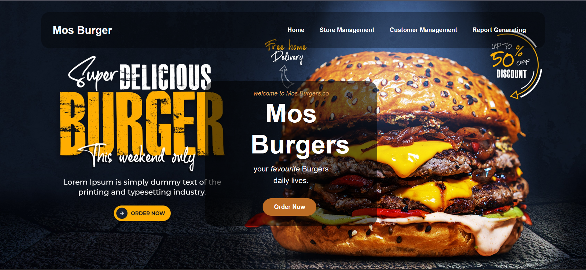
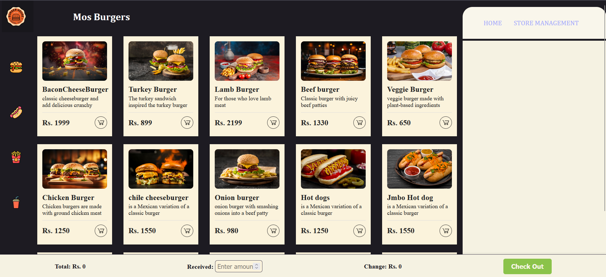
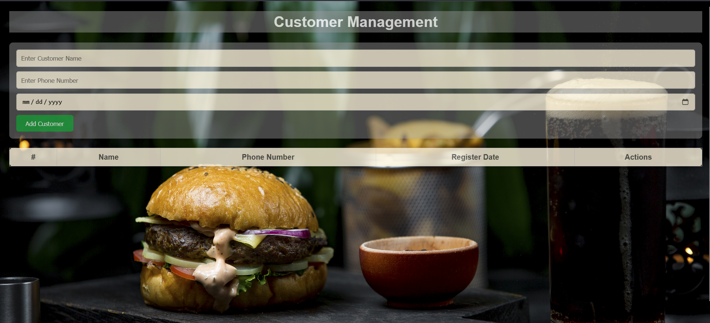

# **MOS Burger - Café Management System**

**MOS Burger** is a dynamic and user-friendly café management system designed to streamline café operations. Developed using **JavaScript**, this project features full CRUD functionality and printable options, allowing for efficient management of orders, receipts, and reports.

## **Features**
- **CRUD Operations**: Manage data efficiently with Create, Read, Update, and Delete functionality.
- **Printable Options**: Easily print receipts, reports, and order summaries.
- **Responsive Design**: Optimized for both desktop and mobile views.
- **Developed with JavaScript**: Built with JavaScript to offer a smooth and interactive user experience.

## **Getting Started**

To get a local copy of this project up and running, follow these simple steps:

### 1. Clone the repository:
```bash
git clone https://github.com/yourusername/mos-burger.git
```

### 2. Open the project folder:
Navigate to the project directory:
```bash
cd mos-burger
```

### 3. Open in a browser:
Open `index.html` in your web browser to view the project.

## **Usage**

Once the project is set up, you can:
- Add, edit, or delete items on the menu.
- Manage orders and generate printable receipts and reports.

## **Screenshots**

Here are some screenshots of the **MOS Burger** system in action:

  
*Home Page*

  
*Order Management Page*

  
*Customer Management Page*

## **Technologies Used**
- **JavaScript**: Main programming language for dynamic content and CRUD operations.
- **HTML5**: For structure and layout.
- **CSS3**: For styling and responsive design.

## **Contributing**

If you'd like to contribute to the development of this project, feel free to fork the repository, make changes, and submit a pull request. Contributions are always welcome!

## **License**
Distributed under the MIT License. See `LICENSE` for more information.


